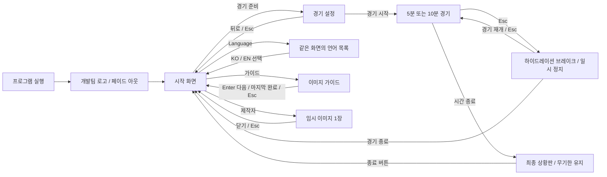

# MANAGER 전시용 게임 화면·UI 구성안

수정: 2026-09-26 · 디자인 시안 v6 · 대상: Unity 6000.3.16f1 / MNG MS3-v3

**현재 산출물은 화면 디자인, 클릭형 미리보기, 한국어·영어 문구표와 Unity 구현 설계다.** Unity Scene, Runtime, 패키지, 모델, 카메라, Player 빌드는 아직 변경하지 않았다. 미리보기의 경기장과 2:1 / 슈팅 8:6은 시각 검토용 예시다. HTML에서의 언어 전환은 화면 검토 기능이며 Unity Localization 적용 완료를 뜻하지 않는다.

사용자의 후속 지시로 모델 간격을 **400K(40만)**로 확정했다. 한국어에서는 초기 모델 / 40만 / 80만 / 120만 / 160만 / 200만, 영어에서는 Initial model / 400K / 800K / 1.2M / 1.6M / 2M의 여섯 단계를 표시한다. v6도 디자인 수정만 수행한다. 언어는 한국어·영어만 사용하고 게임 제목은 **MANAGER(임시)**다. 규칙형 목록은 한국어에서 영문 이름과 한글 이름을 같은 크기로 병기하고 영어에서는 영문만 표시한다. 상황판은 최종 누적 보상 → 슈팅 → 공 회수 → 선방 순서다. 선방은 UI만 두고 관측 구현은 미룬다.

## 1. 산출물 열기

- [클릭형 미리보기](index.html): 더블 클릭으로 실행 가능. 인터넷·서버·별도 폰트 설치 불필요. 폰트 파일을 함께 포함한다.
- [모델 연결 명세](model-catalog.json): 단계별 실제 파일·SHA-256 및 평가 상대 종류.
- [한국어·영어 문구표](ui-strings.csv): 72개 키, 각 2개 언어. Unity String Table 제작용 원고. 감독 이름·설명은 모델 명세의 ko/en 필드에 별도 포함한다.
- [임시 이미지](assets): 팀 로고 1장, 게임 로고 1장, 가이드 3장 × 2언어, 제작자 1장 × 2언어, 경기 구도 1장.
- [검증 기록](qa/verification.md): 브라우저에서 확인한 범위와 Unity에서 확인할 항목.

상단 화면 바로가기와 하단 RED/NAVY 예시 득점·경기 종료 버튼은 **시안 검토 도구**다. 실제 게임 UI에는 포함하지 않는다. `MANAGER` 게임 로고와 `MENIAC` 팀 로고는 교체 가능한 임시 이미지다. 감독 판단과 보상은 3초 간격으로 바뀌는 시연용 예시이며, 모델 추론·실제 경기 보상과 연결되어 있지 않다.

## 2. 시각 방향과 근거

JTBC 월드컵 홍보물의 검정·흰색 강한 타이포그래피, FIFA 2026의 반복 곡선과 다색 면 구성을 참고한다. 시작 화면은 검정 면과 다색 그래픽을 좌우로 나누며, 모델 선택에는 RED·NAVY의 팀색을 크게 사용한다. 경기 HUD는 작은 가로 점수판, 최종 상황판은 밝은 배경과 큰 점수로 구분한다.

확인한 자료:

1. [FIFA 공식 브랜드 공개 자료](https://inside.fifa.com/tournaments/mens/worldcup/canadamexicousa2026/media-releases/fifa-world-cup-26-tm-official-brand-unveiled-in-a-celebration-of-football): 공식 대표 이미지를 브라우저에서 시각 확인. 반복되는 굵은 곡선, 초록·노랑·보라·빨강·파랑, 큰 단색 글자 구성을 참조했다.
2. [JTBC 배포 월드컵 홍보 기사·포스터](https://v.daum.net/v/20260303100448968): 이미지 검색으로 확인한 포스터의 흑백 타이포그래피와 초록 계열 다색 곡선 구성을 참조했다. 기사 본문은 직접 확인하지 못했다.
3. [JTBC 월드컵 관련 공식 클립 페이지](https://tv.jtbc.co.kr/clip/pr10010098/pm10047024/vo10928412/view): 공식 페이지 접근 확인. 이 영상은 경기 분석 프로그램으로, 경기 중계 점수판의 확정 근거로 사용하지 않았다.

**실제 JTBC 2026 경기 중계 스코어보드의 픽셀 배치·서체·전환 애니메이션은 미확인이다.** 따라서 현재 HUD는 방송형 구성 시안이며 방송 원본과 동일하다고 판단하지 않는다. 원본 경기 프레임이 확보되면 점수판의 셀 너비, 시간 위치, 색, 모서리, 숫자 서체를 비교해 맞춘다. 임시 이미지에 방송사·FIFA 공식 로고를 프로젝트 로고처럼 삽입하지 않았다.

| 요소 | 시안 값·적용 |
|---|---|
| 기준 비율 | 가로 16:9. 전시 기준안 1920×1080. 최종 모니터 해상도는 설치 환경에 맞춰 확인 |
| 화면 안전 영역 | 좌우 약 4.6%, 상하 약 5%. 경기 HUD는 좌측·상단 약 4% |
| 주요 배경 | `#101310`, `#111712` |
| 밝은 상황판 | `#ECF0E5` |
| 주요 버튼 | 연두 `#B9F54E`, 어두운 글자 `#14200B` |
| RED / NAVY | `#CA2A3E` / `#25377D`. 이름과 위치로도 구분 |
| 타이포그래피 | Pretendard Regular 400 / Medium 500 / SemiBold 600 / Bold 700 / ExtraBold 800 / Black 900. 본문 400–500, 설명·레이블 500–600, 버튼 700–800, 팀명·게임 제목 900 |
| 조작 피드백 | Hover 밝기, 키보드 포커스 외곽선, 선택 상태 면색·체크 표시 |
| 이미지 | 비율 유지 Contain. 언어별 가이드를 별도 이미지로 교체 가능 |

모션 후보: 팀 로고 유지 1.5초 후 페이드 아웃 0.7초. 이 값은 시안 재생을 위한 초안이며 최종 로고 수급 후 조정한다. 화면 흔들림·반복 번쩍임은 사용하지 않는다.

설명 문구는 기존 0.85–1cqw 중심에서 1.02–1.18cqw로 키웠다. RED의 플레이어 팀과 NAVY의 상대 팀은 1.2cqw/700, 시작 설명은 1.48cqw/500이다. 이미지 가이드·제작자 이미지의 36px 이하 설명도 15% 확대했다. 프리텐다드 원본 OTF 6종을 포함하고 SVG 글자는 같은 폰트의 윤곽으로 저장해 다른 PC에서 폰트가 대체되지 않게 했다. 원고는 `build-design-assets.py`에 유지한다. [Pretendard 공식 배포·라이선스](https://github.com/orioncactus/pretendard), [동봉 라이선스](assets/fonts/LICENSE.txt).

Unity 연결 단계에서는 Pretendard를 우선한다. 현재 단계에서 사용이 어려우면 사용자 지시대로 한글을 표시할 수 있는 기본 폰트를 사용한다. 이번 작업은 Unity 폰트 import나 TextCore 설정을 수행하지 않는다.

## 3. 전체 흐름

팀 로고는 프로세스가 실행될 때 한 번 보이고 경기 후 시작 화면으로 복귀할 때는 다시 보이지 않는다. 설치 후 최초 1회만 표시할지 여부를 영구 저장하지 않는다. 언어 선택은 같은 프로세스의 화면 전환에 유지하고, 다음 실행에서는 한국어로 시작하는 전시용 초안이다.

## 4. 화면별 구성과 입력

| 화면 | 구성 | 입력·전환 | 유지 조건 |
|---|---|---|---|
| 팀 로고 | 어두운 배경 중앙 팀 로고만 표시. 로고 외 문구 없음 | 자동 페이드 아웃 → 시작 | 정상 초기화 완료 후 진행 |
| 시작 | MANAGER 임시 게임 로고 / 경기 준비 / Language / 제작자 / 가이드 | 경기 준비 → 경기 설정 | 초기 포커스 경기 준비 버튼 |
| 언어 목록 | 한국어 ✓ / English 두 항목만 | 한국어·영어 즉시 적용. 바깥 클릭·Esc 닫기 | 별도 Scene 전환 없음 |
| 가이드 | 언어별 가이드 이미지 / 01–03 페이지 / Enter / Esc | Enter 다음 장. 마지막 Enter 닫기. Esc 언제나 닫기 | 열 때마다 1장, 배경 버튼 입력 차단 |
| 제작자 | 현재 언어의 임시 이미지 한 장 / 닫기 | 닫기 또는 Esc | 여러 페이지로 확장하지 않음 |
| 경기 설정 | RED 모델 / NAVY 모델 / 직접 플레이·AI 시뮬레이션 / 5분·10분 | 각 모델 개별 선택 후 경기 시작 | 5분 기본. RED 사람 팀 고정 |
| 경기 | 좌상단 점수·시간 / 우상단 MENIAC / 좌하단 조작 안내 / 우하단 양 팀 모델·감독 판단·누적 보상 | 선택한 경기 시간 경과 → 상황판 | 시뮬레이션은 양 팀 자동 진행 |
| 일시 정지 | 반투명 흰색 배경 / 하이드레이션 브레이크! / 경기 재개·경기 종료 | 경기 중 Esc로 열기. 복귀·Esc로 재개, 경기 종료로 시작 화면 | 시간·판단·보상·득점 표시 타이머 정지 |
| 최종 상황판 | 승리팀·점수 / 최종 누적 보상 / 전체·AI·사람 슈팅 / 공 회수 / 선방 / 종료 | 종료 버튼 → 시작 화면 | 타이머·아무 키·Esc로 자동 닫지 않음 |

전시 흐름에서 상황판의 `종료`는 **애플리케이션 종료가 아니라 시작 화면 복귀**다. 별도 프로그램 종료 버튼은 이번 요구에 추가하지 않는다.

### 시작 화면 확정 문구

| 항목 | 한국어 | 영어 |
|---|---|---|
| 상단 문구 | 휴먼AI공학전공 · 2026 졸업 전시회 | Human Centered AI Major · EXHIBITION 2026 |
| 게임 로고 | MANAGER | MANAGER |
| 설명 | 강화학습 기반 4vs4 축구 게임 개발 | Developing a 4vs4 football game with reinforcement learning |
| 언어 버튼 | Language | Language |
| 메인 버튼 | 경기 준비 ↗ | PREPARE MATCH ↗ |

한국어·영어 시작 화면 모두 전시 문구를 **좌측 상단의 같은 위치**에 표시한다. 영어 문구는 `Human Centered AI Major · EXHIBITION 2026`이며 앞쪽에 중복된 2026은 넣지 않는다. 우측 그래픽의 `THE GAME IS LEARNING.` 문구도 두 언어에서 동일하게 유지한다.

### 경기 HUD

좌상단에는 RED / 점수 / NAVY / 남은 시간만 배치하고 기존 v2 대비 82% 크기로 줄인다. 우상단에는 **MENIAC만** 표시하며 전시 경기 문구를 제거한다. 좌하단은 RED 직접 플레이 문구를 삭제하고 키 안내만 둔다. 키 안내는 84% 배율과 2열·3행 배치를 유지하며, 한국어 14.5cqw × 7.8cqw, 영어 16cqw × 7.8cqw의 언어별 고정 영역을 사용한다. E는 패스 / Pass, SPACE는 슈팅 / Shoot로 표시한다. 이는 시안 문구 변경이며 실제 킥 물리나 슈팅 집계 분류는 바꾸지 않는다.

우하단 감독 패널은 **한국어 24cqw × 7.3cqw**, **영어 28cqw × 8cqw**의 언어별 고정 크기를 사용한다. 모델 이름은 한 줄로 표시하고 이름 아래의 빈 두 번째 줄을 제거한다. 이전 10cqw 높이보다 한국어 27%, 영어 20% 낮아졌다. 양 팀을 각각 한 행으로 배치한 **팀명 + 모델 종류·이름 / 현재 판단 / 누적 보상** 정보는 유지한다. 보상은 부호와 소수점 세 자리를 표시한다. 규칙형의 한글 병기는 모델 선택 목록에 적용하며, 작은 HUD에서는 선택한 locale의 간결한 이름을 사용한다.

현재 판단의 표시명은 전진 운반 / 패스 전개 / 슈팅 시도 / 적극 회수 / 균형 유지 / 후방 보호다. 실제 연결 대상은 기존 `GetDecisionState(team).PreviousCommand`, `GetCumulativeReward(team)`다. 선택된 명령을 표시하며, 정책 원시 출력이나 선수의 실제 행동 성공을 뜻하지 않는다. 규칙형 감독도 동일한 형식이다. 시안의 랜덤 판단 애니메이션은 샘플 순환이며 `uniform-valid` 실행을 재현하는 시뮬레이터가 아니다.

득점 배너는 한국어·영어 모두 **RED GOAL / NAVY GOAL**로 표시하고 해당 팀색을 사용한다. 배경 띠는 게임 화면의 좌우 끝에 정확히 맞춰 전체 폭 100%로 확장한다. 팀 이름과 득점 문구는 중앙에 표시한다.

### 언어별 고정 UI 크기 계약 (v6)

경기 HUD 네 모서리의 기준 여백은 게임 영역 폭의 **1.5%**다. 기존 3–4% 여백보다 가장자리에 가깝게 배치한다. 화면 해상도 및 언어 설정에 따른 크기 변경은 허용한다. 같은 언어 안에서는 모델·판단·점수 등 텍스트 변경 때문에 배경 크기나 위치가 바뀌지 않게 한다. 영어의 가장 긴 글자에 맞춘 여유 공간을 한국어에 강제하지 않는다.

- 점수판: 팀명·시간·점수 셀 폭과 높이를 고정한다. 점수는 세 자리까지 공간을 확보하고 tabular-nums를 사용한다.
- 감독 패널: 모델 이름·판단 문구는 한 줄의 고정 영역에 배치한다. 보상은 부호와 소수점 세 자리를 포함한 여유 폭을 둔다. 행·패널 크기는 변하지 않는다.
- 조작 안내·GOAL 띠: 각 언어 안에서 가장 긴 표기 기준으로 공간을 확보한다. 득점 팀명이 RED/NAVY로 바뀌어도 띠와 텍스트 슬롯은 고정한다.
- 시작·경기 설정 버튼, 팀 배지, 모델 선택 카드·모달, 가이드 이동 버튼, 상황판 행·점수 영역도 고정 폭·높이를 사용한다. 모델 목록은 신경망 3×2, 규칙형 2×2다. 두 선택 탭은 모달 중앙에 정렬한다. 모달 높이는 한국어 26cqw, 영어 28cqw이며 같은 언어 안에서는 탭이 달라도 외곽 크기가 같다. 한국어 팀 배지·뒤로 버튼·모드 선택·가이드 이동 버튼의 불필요한 여유 폭도 줄였다.
- 이번 문구·샘플 값 범위의 시안 규칙이다. 실제 게임에서 숫자의 표현 범위를 확장할 때에도 배경을 늘리지 않고 기존 슬롯 안의 표시 정책을 정한다.

### 하이드레이션 브레이크 (디자인 미리보기)

경기 중 Esc를 누르면 게임 영역 전체에 85% 투명도(불투명도 15%)의 흰색 반투명 배경을 표시한다. 중앙 상단에는 이전보다 약 10% 줄인 **하이드레이션 브레이크! / Hydration Break!** 문구를 두고, 아래에 **경기 재개 / Resume match**, **경기 종료 / End match** 버튼을 배치한다. 별도 확인창 없이 종료 버튼이 초기 시작 화면으로 돌아간다. 앱을 종료하거나 최종 상황판을 표시하는 동작은 아니다.

복귀 버튼 또는 Esc로 같은 경기를 이어간다. HTML 미리보기에서 경기 시간·감독 판단·보상·득점 띠의 남은 표시 시간을 정지하고, 복귀 시 정지해 있던 시간만큼 경기가 건너뛰지 않게 한다. 일시 정지 중 H 전환과 예시 득점·종료 입력을 차단한다. Tab 포커스는 두 버튼 안에서 순환한다. Unity Time.timeScale·물리·실제 입력 구현은 이번 범위에 포함하지 않는다.

### 상황판 글자 확대 (v6)

제목, 팀명, 점수, 모델 이름, 기록 제목, 각 통계의 이름·수치, 하단 안내 및 종료 버튼의 글자를 v5 대비 약 10% 확대했다. 행 순서와 선방의 미측정 표시는 유지하며, 제목·점수 영역과 슈팅 세부 행의 높이를 함께 조정해 겹침을 방지한다.

### 경기 설정

RED와 NAVY는 대등한 크기의 패널로 나눈다. RED 패널에는 직접 플레이 시 `플레이어 팀`, AI 시뮬레이션 시 `AI 팀`을 표시한다. NAVY는 상대 팀이다. 팀 모델은 모두 선택 가능하다. 모델 기본값은 초안에서 양쪽 모두 현 챔피언 2M을 사용한다. 우열을 미리 정하기 위한 기본 상대는 추가하지 않는다.

직접 플레이에서 인간은 현재 입력 계약과 같은 **RED 공격수**를 맡고, 나머지 선수는 해당 팀 감독 AI가 조율한다. 감독 신경망이 선수별 키 입력을 직접 출력하는 구조로 설명하지 않는다. 사람 입력 소유권이 있는 선수의 행동은 AI가 덮어쓰지 않는다.

AI 시뮬레이션은 **2배속**, 직접 플레이는 **1배속**으로 진행한다. 5분 경기는 시뮬레이션에서 실제 약 2분 30초, 10분 경기는 약 5분이 걸린다(일시 정지 시간 제외). 미리보기의 경기 시계·예시 감독 판단·보상 갱신에 이 배율을 적용하며, 정지 중에는 모두 멈추고 재개해도 선택한 배속을 유지한다. 직접 플레이 중 H로 AI 조작을 켜는 것은 게임 모드 변경이 아니므로 1배속을 유지한다.

AI 시뮬레이션에서는 RED도 자동으로 움직이며 NAVY 직접 조작은 제공하지 않는다. 직접 플레이 중 H 전환은 기존 계약을 따르되, AI 시뮬레이션으로 시작한 경기는 실수로 사람이 개입하지 않도록 인간 입력을 잠그는 구현안이다.

### 가이드 이미지 원고

1. **당신의 팀은 RED**: 플레이어 팀과 상대 팀, RED 공격수 조작 설명.
2. **움직이고, 슛하세요**: W/S 전진·후진, A/D 회전, E 패스, Space 슈팅, H 인간·AI 전환. 현재 `MNG_HumanInput`의 키와 대조했다.
3. **AI의 경기를 지켜보세요**: 양 팀 모델 선택, 5분·10분, 경기 종료 기록과 시작 화면 복귀.

가이드는 현재 이미지로 되어 있고 텍스트 가이드 화면을 따로 만들지 않는다. 최종 이미지 교체 시 한국어·영어를 같은 장 수·같은 순서로 공급한다. 키 입력은 열린 가이드가 소비하여 배경 메뉴와 경기에 전달되지 않게 한다.

## 5. 모델 선택 목록

초기 모델은 선택 목록에서 **초기 모델: 0회 / Initial model: 0 steps**, 경기 설정·경기 HUD·상황판에서는 **초기 모델 / Initial model**로 표시한다. 실제 저장 횟수는 숫자 뒤에 `steps`를 쓴다. 영어에서 정확히 1일 때만 `step`이므로 현재의 0 및 여러 단계는 모두 `steps`다. 파일 키와 실제 step 수는 그대로 보존한다.

규칙형 감독은 **Recover → Balanced → Carry & Shoot → Random** 네 항목만 사용한다. 전체 규칙형은 향후 전시 선택 목록에서도 사용하지 않는다. 과거 평가 기록과 원본 구현은 보존하며 이번 디자인 작업에서 삭제하지 않는다.

토너먼트 원본과 실제 파일을 대조하고 여섯 신경망 항목의 SHA-256을 검증했다. `K=1,000`, `M=1,000,000`의 학습 단계 표시이며 실제 저장 step은 정확한 모델 파일에 연결한다. 탭 이름은 **강화학습 모델 / 규칙형 감독**이다.

| 화면 표시 (한국어 / 영어) | 실제 step | 파일 이름 |
|---|---:|---|
| 초기 모델: 0회 / Initial model: 0 steps | 0 | MNG_ManagerV2-0.onnx |
| 40만 / 400K | 400,719 | MNG_ManagerV2-400719.onnx |
| 80만 / 800K | 801,184 | MNG_ManagerV2-801184.onnx |
| 120만 / 1.2M | 1,200,569 | MNG_ManagerV2-1200569.onnx |
| 160만 / 1.6M | 1,600,333 | MNG_ManagerV2-1600333.onnx |
| 200만 / 2M | 2,001,834 | MNG_ManagerV2-2001834.onnx |

전부 `results/MNG_MS3V3-20260925-r002/MNG_ManagerV2/`의 실제 파일이다. `0K`는 **무작위 신경망이 아니라 승인 MS2에서 이어받은 v3 초기 정책**이다. 이번 수정은 MS2를 독립 선택 항목에서 제거하며 0K의 출처나 파일을 바꾸지 않는다.

강화학습 모델 목록의 안내 문구는 다음과 같다. **사전 학습 100만 회는 사용자가 정한 전시 시안의 가정이며, 실제 모델의 학습 이력을 검증하거나 수정한 수치가 아니다.** 위 단계 표시는 그대로 유지하고 사전 학습 횟수를 더해 표시하지 않는다. 모델 명세에도 이 가정의 범위를 기록했다.

| 언어 | 안내 문구 |
|---|---|
| 한국어 | 모든 강화학습 모델은 100만 회의 사전 학습을 거쳤습니다. |
| 영어 | All reinforcement learning models have completed 1 million pre-training steps. |

모델 선택 화면의 좌측 하단 도움말과 우측 하단 선택지 개수는 두 언어 모두 삭제한다.

| 규칙형 감독 (표시 순서) | 종류 | Unity 구현 시 연결 |
|---|---|---|
| Recover: 회수 우선 | 규칙형 | `recover`: 평가기의 회수 행동 선택 규칙 |
| Balanced: 균형 유지 | 규칙형 | `balanced`: 평가기의 균형 행동 선택 규칙 |
| Carry & Shoot: 전진-슈팅 | 규칙형 | `carry-shot`: 슈팅 가능성·소유 여부 기반 선택 규칙 |
| Random: 무작위 선택 | 규칙형 | `uniform-valid`: 행동 마스크로 불가능한 행동을 제외하고 가능한 행동 중 균등 무작위 선택 |

규칙형 감독 목록은 한국어 설정에서 위와 같이 콜론으로 영문·한글을 연결하고 두 이름에 동일한 글자 크기와 두께를 적용한다. 영어 설정에서는 `Recover`, `Balanced`, `Carry & Shoot`, `Random`만 표시한다. 설명은 선택한 언어로 표시한다.

회수/균형/운반슈팅/랜덤은 현재 `Tools/mng_v2_evaluate.py`에서 행동을 공급하는 평가 정책이다. `uniform-valid`의 `rng.choice(np.flatnonzero(valid[0]))`를 확인했다. ONNX 파일로 취급하지 않는다. 향후 전시 빌드에서는 같은 규칙을 Unity 선택기로 연결하고 유효 행동 마스크와의 동등성을 확인한다. 어떤 팀이든 신경망/규칙형 중 하나만 전략 선택 권한을 갖게 한다.

랜덤은 이번 사용자 요청에 따라 **전시 시안의 선택 목록**에 추가한다. 기존 학습·공식 평가의 상대 자격이나 평가 계획을 수정하는 요청으로 해석하지 않는다. 격리 Run r001/r900, 구 MS3-v2 r005 400K는 추가하지 않는다. 모델 원본 이동·이름 변경·재학습은 수행하지 않는다.

## 6. Unity 연결 설계

현행 프로젝트는 `Assets/_Soccer/UI/SoccerHud.uxml`, `.uss`와 `MNG_HudPresenter`의 UI Toolkit을 사용한다. 새로운 전시 전용 UI도 UI Toolkit을 유지한다. 공유 Core HUD를 덮어쓰지 않고 `Assets/_Soccer/Manager/Exhibition/` 아래에 MNG 전용 UI·Builder·Scene을 두는 안이다. 아래 파일은 **아직 생성하지 않은 구현 대상**이다.

| 구성 요소 | 책임 |
|---|---|
| `MNG_ExhibitionShell.uxml/.uss` | 시작·설정·가이드·제작자·상황판 구조와 스타일 |
| `MNG_ExhibitionFlow` | 부팅부터 결과까지 화면 상태, 선택 설정, 모달 입력·포커스 |
| `MNG_ExhibitionModelCatalog` | 표시 이름, 종류, 원본 출처, ModelAsset, 실제 step |
| `MNG_ExhibitionMatchSession` | 로딩 → 양 팀 모델·시간 적용 → 입력 소유권 확정 → 경기 시작 |
| `MNG_ExhibitionHud` | 점수·시간·조작 안내·득점팀·양 팀 모델·감독 판단·누적 보상 표시 |
| `MNG_ExhibitionResultSnapshot` | 종료 순간 점수와 통계 고정. 확장 가능한 통계 행 목록 |
| `MNG_ExhibitionLocalization` | Unity Localization의 locale·LocalizedString 이벤트를 UI Toolkit Label/Button에 연결 |
| `MNG_ExhibitionBuilder` | 기존 MNG 경기 기반의 전시 Scene·UI 연결과 검증 |

경기 설정을 적용하기 전에는 경기가 진행되지 않게 한다. 모델 준비가 끝난 후 명시적으로 시작한다. 같은 모델로 여러 번 실행하거나 모델을 바꾼 뒤 다시 시작할 때 이전 에피소드 점수·슈팅·명령·리커런트 상태가 넘어오지 않아야 한다. 학습/evaluation communicator와 고속 timeScale은 전시 실행에 사용하지 않는다.

### 경기 종료

현재 `MNG_MatchController.ConfigureMatchDuration(seconds, restartWhenFinished, finishMode)`가 존재한다. 전시 실행에서는 `300` 또는 `600`, `restartWhenFinished=false`, 현행 종료 계약을 적용한다. `Finished` 상태는 이미 물리 정지를 수행한다. 종료 시 한 번 결과를 복사하고 화면에 표시하며, 매 프레임 변하는 참조를 결과 화면에 직접 묶지 않는다.

`Finished` 이후 자동 리셋과 입력을 차단한다. 결과 화면에서 `종료`를 선택하면 경기 세션과 통계를 정리하고 시작 화면으로 돌아간다. 선택한 언어는 유지하며 다음 실행에는 한국어 기본 정책을 사용한다. 다음 경기 설정 보존 여부는 초안에서 같은 실행 중 유지한다.

### 슈팅 집계: 확정된 화면 계약과 향후 연결

상황판 기록의 순서는 **최종 누적 보상 → 전체 슈팅 → AI 슈팅 → 사람 슈팅 → 공 회수 → 선방**이다. 슈팅 세 행은 하나의 그룹이며, 그 아래에 공 회수와 선방을 배치한다. 예시 보상은 RED +2.450 / NAVY +1.870, 예시 공 회수는 12 / 9다. 선방은 양 팀 모두 `—`로 두고 화면 밖 시안 안내에 향후 관측 연결 항목임을 명시한다. 미측정 값을 0회로 간주하지 않는다. 선방 관측 카운터·실제 경기 통계 코드는 이번에 구현하지 않는다.

**전체 슈팅 = AI 슈팅 + 사람 슈팅**으로 확정한다. 인간이 개입한 슈팅도 팀 전체에 포함한다. 결과 화면에는 세 행을 모두 표시한다. 직접 플레이 예시는 RED 전체 8 = AI 6 + 사람 2, NAVY 전체 6 = AI 6 + 사람 0이다. AI 시뮬레이션 예시는 양 팀 사람 슈팅 0이며 전체와 AI 값이 같다. 사람/AI 구분은 킥이 실제 적용된 순간의 입력 소유권으로 고정하고, 나중에 H로 전환해도 기존 기록은 재분류하지 않는 연결 설계다.

현재 `MNG_TacticalRewardTracker.GetShotStrikeCount(team)`는 실제 타격 이벤트 중 `Intent=Shot`을 집계한다. 보상을 받은 `ValidShot`이나 감독의 `AttemptShot` 명령 선택 횟수를 전체 슈팅 수로 사용하지 않는다.

현재 `MNG_HumanInput`의 킥은 `Intent=Unspecified`로 전달된다. **기존 tracker만 연결하면 인간 슈팅이 누락된다.** 인간 슈팅을 포함할 요구는 확정되었으며, 실제 개발 때 킥 중 어떤 이벤트를 슈팅으로 분류할지는 다음 후보를 구분해 확정해야 한다. 이번 디자인 작업은 이 분류기를 구현하거나 수치를 임의로 확정하지 않는다.

- A안: 인간의 강한 킥이 실제 공에 맞으면 슈팅으로 집계한다. 조작 의도가 명확하지만 걷어내기도 슈팅으로 셀 수 있다.
- B안: 인간의 킥 중 상대 골문 방향 기준을 만족한 실제 타격만 집계한다. 골문 방향 범위·속도 같은 수치 정의가 필요하다.

집계는 물리·학습 보상·행동 선택을 바꾸지 않는 전시용 통계 계층으로 구성하는 것을 우선한다. KickId로 실제 타격을 중복 제거하고 헛스윙을 세지 않는다. 골 후에는 슈팅 누적치를 유지하며 새 경기 시작 때만 초기화한다. 결과 행은 `statId / localizedLabel / redValue / navyValue`로 두어 추가 지표를 넣을 수 있게 한다. 미정 지표는 실제 측정값처럼 표시하지 않는다.

### 현재 수집 정보로 제안하는 추가 상황판

아래 근거는 2026-09-26 v2 작업에서 소스를 읽어 확인했다. v3에서는 사용자 요청으로 누적 보상·공 회수를 상황판 UI에 반영하고 선방은 관측 예정 항목으로 추가했다. 패스 관련 기록과 감독 판단 분포는 추가 제안으로 유지한다.

| 추천 표시 | 현재 근거 | 의미와 연결 시 주의 |
|---|---|---|
| 패스 시도 | `MNG_TacticalRewardTracker.GetPassStrikeCount(team)` | `Intent=Pass` 실제 타격. 패스 명령 선택 횟수와 구분. 현재 인간 킥을 포함한 전체 패스라고 표기하지 않음 |
| 목표 동료 수신 | `GetIntendedReceptionCount(team)` | 일정 이동 거리·안정 수신 조건을 통과한 의도된 동료 수신. 관람용으로는 '패스 연결'과 상세 설명을 함께 사용 가능. 보상 상한에 종속되지 않는 카운터 |
| 공 회수 | `GetObservedRecoveryCount(team)` | 관측된 상대 점유 → 자기 팀 점유 전환의 회수 조건을 만족한 횟수. 태클 접촉 횟수는 아님 |
| 누적 보상 | `MNG_RewardEngine.GetCumulativeReward(team)` | 팀의 최종 누적 보상. 승점·경기 우열과 같은 의미로 설명하지 않음. HUD와 같은 항목이므로 경기 종료 값 비교에 적합 |
| 감독 판단 분포 | `MNG_ManagerAgent.CopyCommandCounts` / `CopyRawCommandCounts` | 6종 판단의 빈도를 막대로 표시하는 확장안. raw/effective를 구분하고 실제 선택을 기준으로 표시. 규칙형 감독 전체에 공통 집계가 연결되어 있는지는 별도 확인 필요 |

추가 확장 후보는 **패스 시도 · 목표 동료 수신**이다. 감독 판단 분포는 기록이 길어질 수 있어 추후 상세 상황판 영역에 둔다. `GetCompletedPassCount`와 `GetValidShotCount`는 보상을 받은 경우에 증가하므로 그대로 일반 '패스 성공'·'유효 슈팅' 통계로 표시하면 안 된다. `ObservedOnTargetCount / ObservedBlockedCount / ObservedSaveCount`가 null인 소스 상태와 선방 UI 추가를 구분한다. 선방은 수집 완료가 아니라 향후 관측 연결 대상으로만 표시한다. 현재 소유 상태만으로 전체 점유율이 누적된다고 주장하지 않는다.

### 카메라

현재 중계 카메라 기본 위치는 `(0,100,-100)`, FOV `55°`이며 `MNG_SpectatorCamera`가 복원할 기준값을 캡처한다. 전시 전용 카메라에서 경기장 중심 방향으로 위치를 조금 당겨 선수와 공을 더 크게 보이게 한다. 조정값은 실제 화면의 양 골문·터치라인 가시성과 함께 확정한다. 공통 Core 상수를 바꿔 기존 학습/평가/5환경 카메라에 일괄 적용하지 않는다.

현재 H로 인간 조작에 들어가면 3인칭 추적 시점으로 바뀐다. 이번 중계 카메라 근접 요청은 우선 중계 시점에 적용하는 설계다. 인간 조작도 중계 카메라로 고정할지는 아직 정해지지 않았다. 시안의 경기장 SVG는 구도 예시이며 실제 카메라 변경 증거가 아니다.

## 7. Unity Localization 설계

현재 `Packages/packages-lock.json`에는 `com.unity.localization`이 없다. 구현 시 패키지 설치·해결 및 설정/테이블 에셋 생성이 필요하다. 번역 사전만으로 게임의 locale 상태를 따로 만드는 방식은 사용하지 않는다.

1. Unity Package Manager에서 Localization 패키지를 설치하고 resolved lock·어셈블리 로드 확인.
2. `ko`, `en` locale과 전시용 LocalizationSettings 생성. Startup Locale Selector로 한국어를 지정한다. 시스템 언어로 첫 화면이 바뀌지 않게 한다.
3. String Table Collection `MNG.Exhibition.UI`에 문구표의 72개 키와 모델 이름·설명 키를 넣는다. 실제 Unity 변환 시 언어별 열을 locale에 매핑한다. CSV 자체가 Unity 테이블 에셋은 아니다. Language는 두 locale 모두 같은 문자열이다.
4. UI Toolkit 텍스트는 `LocalizedString.StringChanged`를 Label/Button에 연결하고 해제 시 구독을 제거한다. 언어 버튼은 `LocalizationSettings.SelectedLocale`만 변경한다.
5. Asset Table Collection `MNG.Exhibition.Art`에 가이드·제작자 이미지를 넣는다. 한국어·영어 두 locale만 지원한다. 일본어·중국어 항목은 화면과 locale 구성에서 제거하며 준비 중 버튼도 두지 않는다.
6. Pretendard를 기본으로 폰트 에셋과 PanelTextSettings를 지정한다. 사용이 어려우면 한글 표시 가능한 기본 폰트를 사용한다. UI Toolkit의 FontDefinition/TextCore 경로를 사용하고 uGUI용 TMP 컴포넌트 연결을 그대로 복사하지 않는다.
7. 필요한 localization 자산을 Addressables 로컬 그룹으로 포함하고 PlayerContent를 빌드한다. 전시 실행은 네트워크 없이도 초기화·언어 전환·이미지 표시가 가능해야 한다.
8. 초기화 실패 시 빈 버튼이나 번역 키가 노출되지 않도록 시작 상태를 유지하고 오류 상태를 표시한다. 문자열과 이미지 로딩 도중 이전 locale의 늦은 응답이 새 화면을 덮지 않도록 수명·locale을 확인한다.

## 8. 구현 순서와 완료 조건

1. **디자인 검토**: 현재 시안의 화면·동선·문구 확인. 실제 중계 점수판 프레임을 확보하면 HUD 정밀 반영.
2. **전시 셸·Localization**: 전용 Scene, 한국어 기본, 영어 즉시 변경, 가이드·제작자·로고 연결.
3. **모델·경기 연결**: 강화학습 6단계+규칙형 감독 4개, 양 진영 독립 선택, 직접 플레이 RED 고정, 300/600초.
4. **상황판·통계**: 인간 슈팅 정의 확정, 실제 타격 집계, 종료 스냅샷, 종료 전 유지.
5. **카메라·시각 검증**: 근접 중계 카메라, 실제 전시 모니터 한글/영어 가독성, 골문·선수 가림 확인.
6. **Windows 빌드**: 사용자가 선택한 구현 범위가 Player까지일 때 전용 빌드를 생성한다. 프로젝트의 Build-MNGCurrent 또는 전용 Builder 후 Build-Lifecycle Register/Use 기준을 준수한다.

| Unity 검증 항목 | 합격 기준 |
|---|---|
| 첫 실행 | 한글 기본 → 팀 로고 페이드 → 경기 준비 버튼 사용 가능 |
| 언어 | 전 화면 KO/EN 문자열·이미지 전환, 번역 누락·한글 네모 글리프 없음 |
| 가이드 | Enter 1→2→3→닫기, Esc 즉시 닫기, 배경 입력 없음 |
| 제작자 | 단일 이미지 표시, Esc·닫기 복귀 |
| 모델 | 6단계 파일 SHA 일치, 양 팀 독립·동일 모델·규칙형 혼합 조합 검증 |
| 인간 입력 | RED 공격수만 가능, 시뮬레이션에서 인간 입력 차단 |
| 시간 | 실제 300초/600초 설정, 시작 전 카운트다운 진행 없음 |
| 결과 | 점수·실제 슈팅 수 일치, 전체 = AI + 사람, 인간 슈팅 포함, 골 후 누적 유지, 중복 집계 없음 |
| 결과 유지 | 30초 이상 대기·Esc·임의 키로 닫히지 않음. 종료 버튼만 복귀 |
| 반복 사용 | 최소 3경기 연속 전환, 이전 점수·통계·모델 상태 누수 없음 |
| 카메라 | 실제 Play에서 공·양 골문·팀 표시 가시성, 인간 시점 왕복 정상 |
| 전시 빌드 | 외부 Python/Trainer/인터넷 없이 실행, 입력·언어·최종 상황판 정상 |

이번 문서·시안은 이 Unity 합격 조건을 통과했다는 보고가 아니다. 시안 검증과 Unity 실행 검증은 [검증 기록](qa/verification.md)에 별도로 표시한다.

시뮬레이션 모드에서는 시간 표시 바로 오른쪽에 빨간 배경·흰 글씨의 **2배속 / 2× SPEED** 고정 크기 배지를 표시한다. 직접 플레이에서는 숨기며, 일시 정지·재개 중에도 모드에 따른 표시를 유지한다. 일시 정지 제목은 흰색 계열 #F7F8F2로 표시하고 게임 영역 상단 7% 위치에 독립 배치한다. 초록색 가로선은 제거한다. 경기 재개·경기 종료 버튼은 하단 중앙에 나란히 배치하며 하단 여백은 게임 영역 높이의 4%다. 일시 정지 배경은 투명도 85%를 적용하고 블러는 사용하지 않는다.
